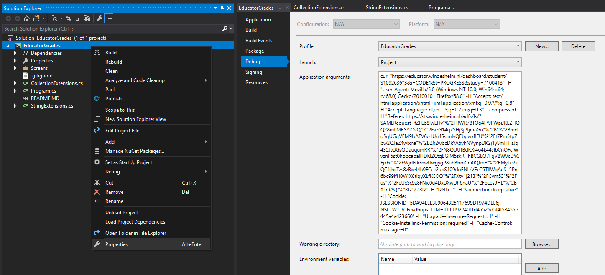

# Educator average grades
Have you ever wondered what happens when you're too lazy to copy over a few grades to Excel manually? You end up taking two hours to automate the process instead. I hereby present to you: EducatorGrades, an over-engineered tool to automatically calculate your average grade on Educator/Bison.

# How to use
1. Visit the Educator website (mine is educator.windesheim.nl) using Firefox or Chrome (or equivalent).
2. Hit F12 to open the console window.
3. Open the networking tab.
4. Log in to Educator.
5. Select a period (e.g. "Hoofdfase").
6. Copy the last command as cURL:

7. Open the solution.
8. Go to the project's Properties -> Debug:

9. Paste the command in "Application arguments" or just compile the application and run it using the copied command as a command line argument.
10. After running, you'll get a console window that shows your average grade: 

11. Hooray cum laude.